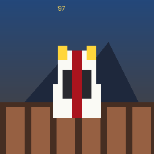

# DukesOfDuchesca-napoli97

A [PRG32](https://github.com/riscv-prg32/PRG32) cartridge: a top-down
car-chase game freely inspired by *The Dukes of Hazzard*, relocated to
Napoli in 1997.

You drive a pimped-up white Fiat 500 classic across a Naples-flavoured city
many times larger than the screen, chased by scooter gangs who want to
steal your ride and police cars who are curious about it. Collect all
eight essential party items scattered across the city's piazzas — beer,
wine, Sangria Papelis, amplifiers, loudspeakers, a mixer, disco lights and
nice girls — keep an eye on the fuel gauge, and reach the party villa to
win.



## Controls

| Input        | Action                                  |
|--------------|------------------------------------------|
| D-Pad UP     | Accelerate                                |
| D-Pad DOWN   | Brake / reverse                           |
| D-Pad LEFT/RIGHT | Steer                                 |
| A            | Honk (scares off nearby scooters)         |
| START        | Pause / confirm on menus                  |

## How it maps to the PRG32 hardware format

- **Sprites are 4bpp indexed** (`prg32_indexed_sprite_t`, `bits_per_pixel =
  4`): the player's car, the scooter gang, and the police cars are each
  hand-generated at 8 headings (N/NE/E/SE/S/SW/W/NW) by
  [`scripts/gen_assets.py`](scripts/gen_assets.py) into
  [`assets_generated.h`](assets_generated.h).
- **The party villa landmark is a genuinely 8bpp indexed sprite** (8
  colours), also produced by `gen_assets.py`. PRG32's engine tiles
  themselves are a fixed 1bpp-mask format (`prg32_tile_define`), so the
  repeating street/building fabric necessarily uses that native tile
  format — the 8bpp budget goes to the one bespoke landmark that benefits
  from real detail instead.
- **The map is a torus-streamed tilemap far larger than the 320x200
  viewport.** PRG32's built-in playfield buffer is a fixed 64x32 tiles
  (512x256px) that wraps at its edges (see
  `components/prg32/prg32_tile.c`'s `wrap_index`); [`citymap.c`](citymap.c)
  procedurally derives a 220x130-tile (1760x1040px, ~5.5x the viewport)
  Naples-flavoured city on demand, and [`game.c`](game.c) streams a window
  of that city into the wrapping playfield buffer as the camera moves
  (`stream_to`/`stream_column`/`stream_row`), so the car can drive across a
  city many screens wide while the engine only ever holds a small window of
  it in memory. Gameplay logic (collision, pickups, gas stations, the win
  condition) queries the procedural map directly (`cm_tile_at`), never the
  streamed rendering buffer, so it's correct regardless of what has been
  streamed.
- **The city layout is a stylised homage**, not a survey of the real map:
  long "decumani" crossed by narrow "cardini" (echoing Naples' historic
  Greek-grid center), a Gulf-of-Naples coastline with a slow-parallax
  Vesuvio backdrop, and eight named piazzas plus a Posillipo-style party
  villa. See `citymap.c` for the exact layout rules.

## Project layout

```
game.c                  cartridge entry points: dukes_init/update/draw
citymap.h / citymap.c   pure map/physics logic, no prg32.h dependency
assets_generated.h      generated 4bpp vehicle + 8bpp villa sprites
assets_icons.h          hand-authored 8x8 1bpp item/gas icons
scripts/gen_assets.py   regenerates assets_generated.h
scripts/gen_marketing_assets.py  regenerates assets/icon.png + screenshot.png
tests/test_citymap.c    host unit tests for the pure map logic
tests/prg32_stub.c      host stand-in for the PRG32 engine API
tests/host_harness.c    dynamic fuzz test of the full game loop on host
build.sh                builds the cartridge via the prg32 CLI
```

## Testing

This repo was developed without an ESP-IDF/RISC-V toolchain available, so
it's verified two ways on a plain host compiler instead of the real
target:

```sh
# Pure map-logic unit tests (deterministic, no engine dependency)
cc -Wall -Wextra -std=c11 citymap.c tests/test_citymap.c -o /tmp/test_citymap && /tmp/test_citymap

# Full game loop against a host stand-in of the PRG32 engine calls:
# scripted play-throughs plus ~60k fuzzed frames asserting the car can
# never end up inside a solid tile, all counters stay in range, and the
# streaming/camera math never crashes.
cc -Wall -Wextra -std=c11 -DDUKE_HOST_TEST game.c tests/prg32_stub.c tests/host_harness.c -o /tmp/host_harness && /tmp/host_harness
```

`game.c` itself is also compiled with `-fsyntax-only` against the real
`prg32.h`/`prg32_audio.h` headers (from a PRG32 checkout) to catch any ABI
drift. None of this replaces building the actual cartridge and running it
in QEMU or on hardware -- do that before shipping.

## Building the cartridge

Requires a checkout of [riscv-prg32/PRG32](https://github.com/riscv-prg32/PRG32)
with ESP-IDF sourced (`source $IDF_PATH/export.sh`):

```sh
PRG32_REPO=/path/to/PRG32 ./build.sh            # builds for QEMU
PRG32_REPO=/path/to/PRG32 ./build.sh . esp32c6  # builds for ESP32-C6 hardware
```

Then, from inside the PRG32 checkout:

```sh
python3 -m prg32 qemu build-and-run   # after: python3 -m prg32 qemu upload <path>/dist/dukesofduchesca-napoli97-qemu.prg32
```

## License

MIT, see [LICENSE](LICENSE).
