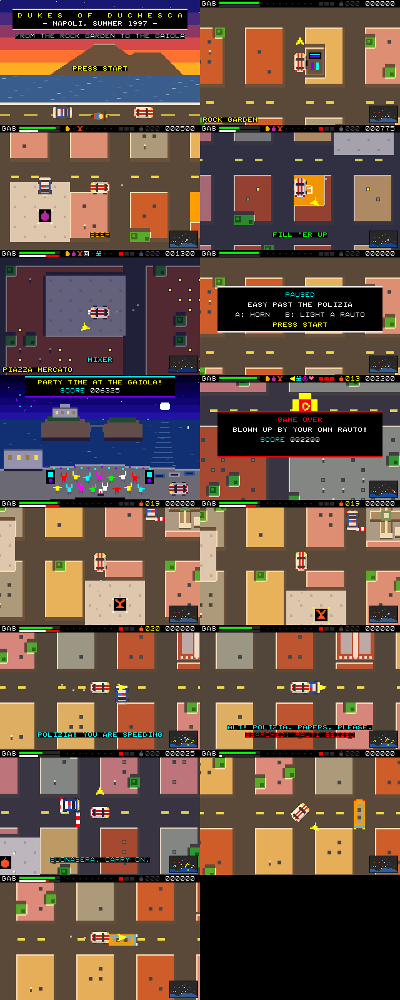
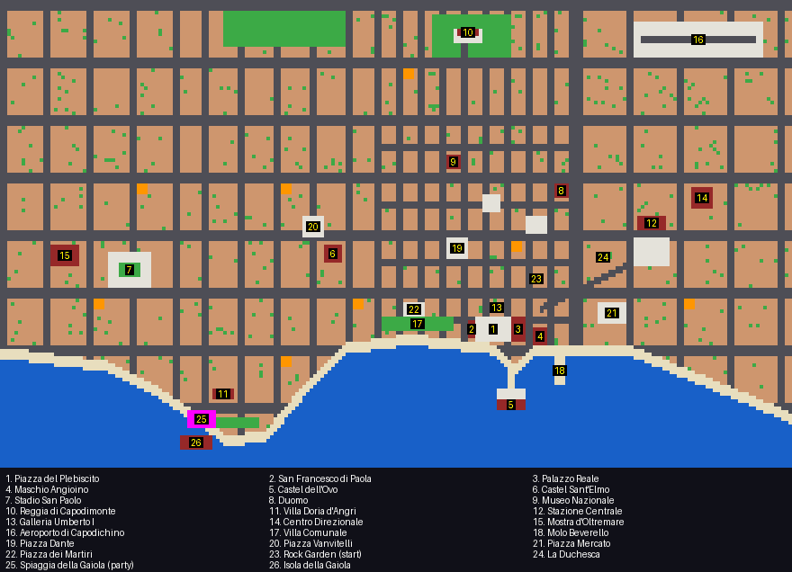

# DukesOfDuchesca-napoli97

A [PRG32](https://github.com/riscv-prg32/PRG32) cartridge: a top-down
car-chase game freely inspired by *The Dukes of Hazzard*, relocated to
Napoli in the summer of 1997.

The night starts outside the **Rock Garden**, the underground rock club of
Via San Giovanni Maggiore Pignatelli, in the vicoli of the university quarter
a few doors from the Rettifilo and a short drive from the Duchesca. You drive
a pimped-up white Fiat 500 across a city many times larger than the screen,
chased by scooter gangs who want to steal your ride and watched by police
patrols who will leave you alone as long as you drive past them slowly. Collect the eight things no party can do without —
beer, wine, Sangria Papelis, an amplifier, loudspeakers, a mixer, disco
lights and nice girls — keep an eye on the fuel gauge, and reach the party
before the night is over. The party is on the **beach of the Gaiola**, the
cove under Capo Posillipo that faces the two tuff islets joined by their
little bridge, where the summers of the 1990s saw parties that were great fun
and not entirely legal. The game closes there, with everybody dancing on the
sand.



## Controls

| Input            | Action                                             |
|------------------|----------------------------------------------------|
| D-Pad            | Point where to go: the car turns that way and accelerates |
| A                | Horn: scooters nearby turn tail (1.5 s to recharge) |
| B                | Light a rauto and leave it on the road              |
| START            | Start, pause                                       |

**Steering.** The D-pad is a direction, not a wheel: hold LEFT and the Fiat
comes round to the west by the shortest side (a right angle takes a tenth of
a second) and pulls away; let go and it coasts to a stop. Diagonals work.
Facing the wrong way it brakes while it turns, so a U-turn stays inside the
street, and if you take a turning up to eight pixels early or late the car is
nudged into the opening instead of stopping against the corner.

**Traffic.** Other cars and the orange city buses share the streets. They are
solid, so you go round them — keep the D-pad held and the Fiat changes lane
by itself — and they never run you over: they stop and wait. Scooters and
police weave through them.

**The police.** Patrol cars cruise the streets (blue on the radar) and
scooters run from them, so a patrol nearby is cover. But the white bar under
the fuel gauge is your speed, and where it turns red you are over the limit
the police tolerate (two thirds of flat out):

- cross one of the seven *posti di blocco* (striped barriers and a parked
  patrol car; white dots on the radar) over the limit and you are flagged
  down on the spot; roll through with the D-pad released and you are waved on;
- speed under the eyes of a patrol for more than a moment and it gives
  chase, siren on; outrun it for ten seconds or get 150 pixels away and it
  gives up;
- light a rauto within earshot of a patrol and it comes looking.

Caught or flagged down, the Fiat is halted for a few seconds and searched.
What they find is luck: the rauti three times out of four, each party item
one time in four (two at most). A confiscated item goes back to the piazza
it came from. After a search the police leave you alone for eight seconds.
The police never damage the car: only scooters and your own rauti do.

**Rauti.** A *rauto* is a banger. Seven boxes of twenty are lying around the
city (red dots on the radar, the first behind Piazza del Plebiscito). B lights
one and leaves it where the car is; two seconds later it goes off and takes
out every scooter within 30 pixels — and dents the Fiat, like a scooter
would, if it has not driven clear by then. Up to four can be burning
at once.

The yellow arrow orbiting the car points at the nearest item still missing;
it turns magenta and points at the Gaiola once the boot is full. The radar in
the corner shows the whole gulf: items blink yellow, gas stations are orange,
the beach is magenta. Three brushes with a scooter (or your own rauti) and the
night is over; so is an empty tank. A scooter that cannot catch you in twenty
seconds gives up.

## The city



The world is shown at two screen pixels per world pixel: the viewport covers
20x12.5 tiles and the vehicles are 40x40 sprites.

The map is a stylised Napoli laid out after the overview plate of a city
street atlas — drawn from memory of it, not copied and not to scale:

- **the coast of the gulf**: the bay of Bagnoli, the Posillipo promontory
  (the beach and the islets of the Gaiola, Parco Virgiliano at the cape), Mergellina and Via
  Caracciolo with the Villa Comunale, the bump of Santa Lucia with Castel
  dell'Ovo on its islet, Molo Beverello and the port, and the shore falling
  away south-east towards San Giovanni; a lungomare follows all of it;
- **the districts**, west to east, each with its own block size: Fuorigrotta
  (the Stadio San Paolo), Posillipo, the Vomero (Piazza Vanvitelli) and
  Chiaia (Piazza dei Martiri), the tight Greek grid of the centro storico
  with three decumani where the rest of the city has one (Piazza Dante,
  Piazza Bellini, Largo Corpo di Napoli, Piazza del Plebiscito), the
  diagonal Rettifilo down from Piazza Garibaldi, Piazza Mercato, and the
  grey sheds of the industrial east;
- **the north**: the Camaldoli hill, the woods and the Reggia of Capodimonte,
  the runway of Capodichino.

Twenty-six **points of interest** stand where a visitor would look for them,
and the name of the place comes up on screen as the car reaches it
([all of them](release-artifacts/points-of-interest.png)). The monuments are
buildings you drive around, each drawn in its own shape: Piazza del
Plebiscito between the dome and colonnade of San Francesco di Paola and the
red front of Palazzo Reale; the five towers of the Maschio Angioino by the
port; Castel dell'Ovo on its islet; the star of Castel Sant'Elmo on the
Vomero; the Rock Garden under its neon sign; the Stadio San Paolo with its pitch; the Duomo; the Museo
Archeologico Nazionale at the top of Via Toledo; the Reggia di Capodimonte in
its woods; the Stazione Centrale with its tracks; the Galleria Umberto I; the
glass towers of the Centro Direzionale; the Mostra d'Oltremare; Villa Doria
d'Angri on the hill of Posillipo; and, off the cape, the islets of the
Gaiola with their villa and bridge, above the beach where the night ends.

It is 220x130 tiles (1760x1040 world px, 114 screens at this zoom) and stores
no tile array: [`citymap.c`](citymap.c) computes every tile on demand from a
coastline of 14 corner points, 26 points of interest, 7 checkpoints, 30 named rectangles and
modulo arithmetic.

## How it uses the PRG32 firmware

- **Indexed colours.** On the ESP32-C6 the framebuffer is one byte per pixel
  and the firmware maps every RGB565 colour to a cell of its 6x6x6 cube. The
  city is drawn with `prg32_gfx_rect_indexed()` through the 32 palette
  entries the cube never uses, and every sprite colour is written into the
  entry of its own cell, so the board shows the authored colours exactly as
  QEMU does. The host harness checks this on every frame.
- **No tile engine.** v1 used the firmware's playfields, which fill every 8x8
  tile with RGB565 rectangles, quantised pixel by pixel on the board. v2
  draws one indexed rectangle per run of equal ground (a `memset` on the
  board) plus small details: roofs lit from the north-west, windows,
  trees, the parapet of the lungomare.
- **Palette effects.** The picture is recoloured by rewriting palette
  entries: golden hour turning into night over two minutes, windows lighting
  up group by group, the shimmering gulf, the villa's dance floor and string
  lights, police light bars, a white flash and a screen shake on a crash,
  fades between screens, a banded sunset on the title.
- **Sprites.** The vehicles are 40x40 4-bpp indexed sprites at 8 headings (`prg32_sprite_draw_indexed`); item icons and compass
  arrows are 1-bpp indexed sprites with a transparent background.
- **SID-like stereo audio.** Eleven procedural instruments and four original
  tracks (a serenade on the title, a 6/8 tarantella while driving, a 90s
  dance loop at the villa, a lament when it goes wrong) on tracker voices
  0-4. Voices 5-7 are the game's: an engine note that follows the speed, the
  horn, pick-ups, crashes, and a two-tone siren panned to where the police
  car is. The tarantella speeds up while someone is on your tail
  (`prg32_audio_set_tempo`).
- **Fixed 33 ms simulation steps**, so the pace holds when the board draws
  slower than 30 fps, and a press between two steps is never lost.
- **Scores** go to the firmware scoreboard
  (`prg32_score_submit_current_player`).

The cartridge fits the default 64 KiB cartridge RAM profile and the 64 KiB
package limit, soundtrack, icon and screenshot included; `build.sh` prints
the exact sizes and fails if either is exceeded.

## Project layout

```
game.c                     cartridge entry points: dukes_init/update/draw
citymap.h / citymap.c      pure map logic, no prg32.h dependency
assets.h                   generated sprites, icons and palettes
audio.json                 generated instruments and tracker events
metadata.json, colophon.json, icon.png, screenshot.png   Store metadata
scripts/gen_assets.py      regenerates assets.h
scripts/gen_music.py       regenerates audio.json
scripts/render_screens.py  renders the real screens on the host; Store media
scripts/qemu_capture.py    runs the cartridge in the QEMU firmware
scripts/store_manifest.py, scripts/check_store_bundle.py   Store bundle
tests/test_citymap.c       map unit tests (reachability by flood fill)
tests/map_dump.c           dumps the whole city for release-artifacts/map.png
tests/prg32_stub.c         host model of both PRG32 display back ends
tests/host_harness.c       autopilot, traffic and fuzz runs of the real game
test.sh, build.sh          host checks; cartridge and Store bundle
dist/                      the released Store bundle (tracked)
release-artifacts/         screens from the host model and from QEMU
```

## Testing

```sh
PRG32_REPO=/path/to/PRG32 ./test.sh
```

- `tests/test_citymap.c` flood-fills every position the car's collision box
  can occupy and asserts that every item, gas station, the villa and every
  open tile is connected to the start, and that the coast has the shape of
  the gulf.
- `tests/host_harness.c` runs the real `game.c`: it checks the rauto's fuse
  to the tick (driven away from: no damage; sat on: one knock) and the
  traffic (a bus in the lane is overtaken; an oncoming car never drives into
  the Fiat), the police (a scooter runs from a patrol; a slow pass is ignored; speeding is
  chased and searched; a checkpoint at speed halts, a slow one waves on), an
  autopilot
  wins the game on empty streets (all eight items, refuelling on the way),
  makes a grand tour of all 26 points of interest, plays twelve nights in
  traffic, then 60,000 fuzzed frames. Every frame asserts that the
  car and the chasers never overlap solid ground and that the QEMU and
  ESP32-C6 display models show the same picture, pixel for pixel. The build
  uses AddressSanitizer and UBSan.
- `game.c` is compiled with `-Wall -Wextra -Werror` against the real
  `prg32.h`.
- `scripts/qemu_capture.py` boots the built cartridge in the QEMU firmware,
  starts a game, drives, and saves real frames, the mixer's output and the
  console log to `release-artifacts/qemu/`.

It has not been run on an ESP32-C6 board: do that before trusting the frame
rate there.

## Building

Requires a checkout of [riscv-prg32/PRG32](https://github.com/riscv-prg32/PRG32)
`main` and the RISC-V toolchain installed by ESP-IDF:

```sh
PRG32_REPO=/path/to/PRG32 ./build.sh
```

This runs the tests, builds the portable cartridge, attaches the Store
metadata for `esp32c6` and `qemu`, packs
`dist/dukesofduchesca-napoli97-<version>-store.zip` and, when a
[CartridgeStore](https://github.com/riscv-prg32/CartridgeStore) checkout is
next to this one (or `CARTRIDGE_STORE_ROOT` is set), validates the bundle
with the Store's own intake code.

To play it in QEMU, from the PRG32 checkout:

```sh
python3 -m prg32 qemu build
python3 -m prg32 qemu upload /path/to/dist/store/dukesofduchesca-napoli97-qemu.prg32
python3 -m prg32 qemu start
```

## License

MIT, see [LICENSE](LICENSE). Freely inspired by a television series it is not
affiliated with; code, art and music are original.
